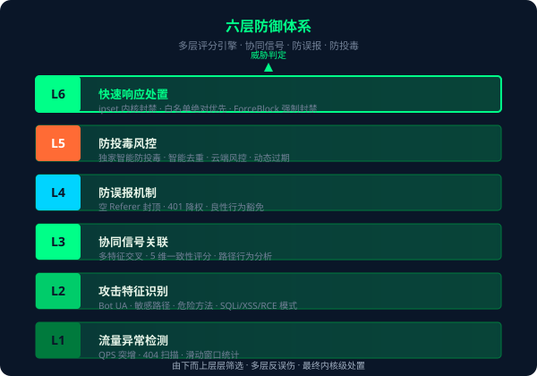
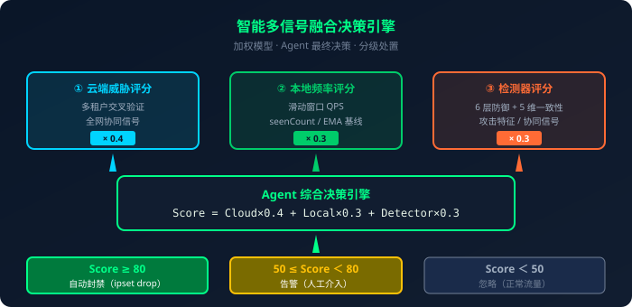
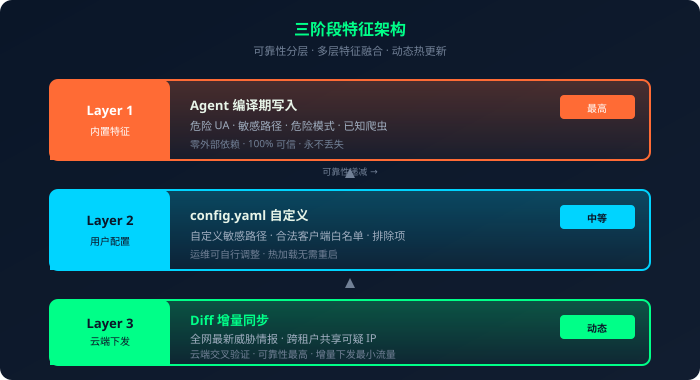
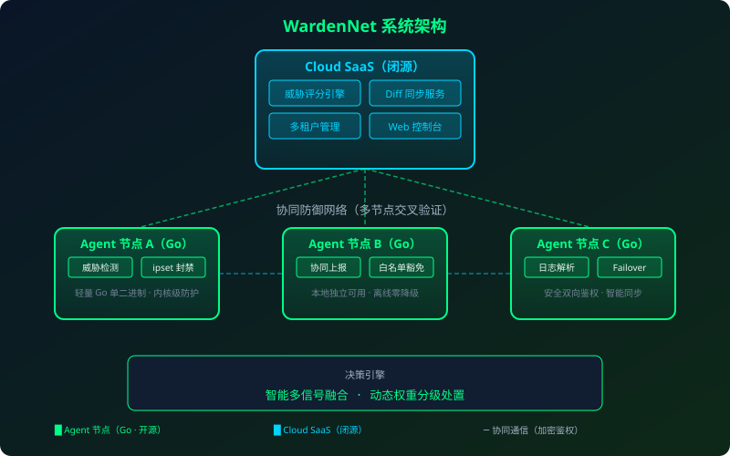
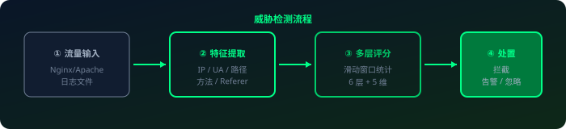
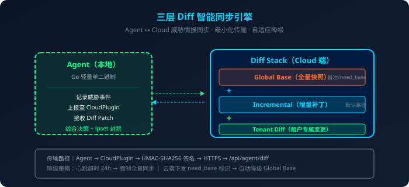

title: "WardenNet — 开源分布式Web服务器攻击IP联防平台｜项目介绍"
---

# WardenNet — 开源分布式Web服务器攻击IP联防平台｜项目介绍

> **一处发现，全网御敌** — 每台服务器都是哨兵，联合起来就是一支军队。

---

## 目录

1. [项目概述](#1-项目概述)
2. [行业痛点](#2-行业痛点)
3. [产品定位与核心理念](#3-产品定位与核心理念)
4. [核心能力清单](#4-核心能力清单)
5. [系统架构图](#5-系统架构图)
6. [技术实现亮点](#6-技术实现亮点)
7. [部署与运维](#7-部署与运维)
8. [商业模式与合规说明](#8-商业模式与合规说明)
9. [对比优势](#9-对比优势)
10. [发展路线图](#10-发展路线图)
11. [联系方式与社区链接](#11-联系方式与社区链接)

---

## 1. 项目概述

**一句话定位：** WardenNet 是业界首款采用「开源 Agent + 闭源 Cloud SaaS」混合模式的 Web 端轻量级协同防御网络，为中小站长和小微企业提供成本极低的 IP 级威胁检测与智能封禁能力。

**Slogan：** **一处发现，全网御敌**（One detects. All defend.）

WardenNet 的独特之处在于——它不是一个孤立的防护脚本，而是一个**协同防御网络（Collaborative Defense Network）**：当一台服务器上的 Agent 识别出新的威胁 IP，这个情报会被加密上报至云端；云端完成交叉验证与风险评分后，以增量 Diff 方式安全分发给全网其他 Agent，形成「一处发现，全网协同防御」的闭环防御链。

---

## 2. 行业痛点

### 痛点一：商业 WAF 贵且重

市面上常见的商业 WAF / DDoS 防护产品，月费动辄数千甚至数万元，还需配套硬件设备和专业运维团队。对于中小站长、独立开发者、小微运维团队而言——**这套体系太重、太贵、完全用不起**。

### 痛点二：开源防护脚本弱且孤岛

虽然社区有不少 Nginx 恶意扫描防护脚本，但普遍存在以下问题：

- **单机孤岛：** 每台服务器独立运行，无法共享威胁情报；
- **容易误封：** 仅凭单机统计就封禁 IP，正常用户或搜索引擎爬虫常被误伤；
- **无法自动拦截：** 多数脚本只记录日志或发告警，需人工手动处理；
- **无风控机制：** 开源脚本可被攻击者篡改、刷库，反向污染防护体系。

### 痛点三：威胁情报平台无法落地拦截

市面上的威胁情报平台（Threat Intelligence Platform）多以 API 查询或情报订阅为主，**不直接对接防护层**，需要用户自己写胶水代码实现「情报 → 封禁」的闭环——这对多数中小用户来说门槛过高。

---

## 3. 产品定位与核心理念

### 协同防御网络（Collaborative Defense Network）

WardenNet 将每一台接入的 Web 服务器都转化为一个**安全哨兵（Sentinel）**。单个哨兵的视野有限，但数千个哨兵联网后，就构成了一张覆盖全网的威胁探测网：

- **横向扩展能力：** 新增一台服务器 ≈ 新增一个情报采集点；
- **交叉验证置信度：** 一个 IP 被多租户、多节点同时标记 → 高置信度全网封禁；
- **分级隔离：** L1 级可疑 IP 仅本地生效，绝不因单个误报污染全网。

### 信任模型：开源 Agent 可信 + Cloud 风控可控

WardenNet 采用**非对称信任架构**：

| 组件 | 信任假设 | 应对策略 |
|------|----------|----------|
| **开源 Agent** | 运行于用户自有服务器，代码开源可审计 | Agent 本地独立可用，即使被篡改也最多污染**自身上报**，无法影响云端评分算法 |
| **Cloud SaaS** | 由 WardenNet 团队运营 | 云端不信任任何原始上报——CloudPlugin 在 Agent 本地完成证据签名验证后仅上报元数据（IP、评分、证据 digest、HMAC 签名），云端再做多租户交叉验证、智能去重、QPS 限流和投毒风控 |

> 核心原则：**云端永远不信任客户端，客户端永远依赖云端交叉验证**。

---

## 4. 核心能力清单

### 4.1 六层防御体系

WardenNet 的检测逻辑不是单一阈值判定，而是一层一层剥洋葱：

| 层级 | 机制 | 说明 |
|------|------|------|
| **L1 流量异常** | QPS 突增、404 扫描密度 | 捕获最基础的行为偏离 |
| **L2 攻击特征** | Bot UA、敏感路径、危险 HTTP 方法（PUT/DELETE/PATCH）、路径遍历、文件上传探测 | 识别强攻击意图的绝对特征 |
| **L3 协同信号** | 多维度关联分析 + 5 维一致性评分 | 用前缀连贯度、新颖度饱和、路径集中度、状态同质性、方法语义来"识别人"——像不像真实用户 |
| **L4 防误报** | 空 Referer 硬封顶、401 降权、legitimateUserContext 强降权、单维度封顶 | 宁可放过，不可误杀 |
| **L5 防投毒** | 独家智能防投毒算法、智能去重、云端风控机制、动态过期、分数门槛 | 抵御攻击者篡改客户端刷库 |
| **L6 快速响应** | 白名单绝对优先、远程 ForceBlock、Failover 自动降级 | 管理员可控、系统自恢复 |

### 4.2
<br/>

<p align="center">



</p>

### 4.2 五维一致性评分（Consistency Score）

除了统计异常，WardenNet 还从**纯统计形状**出发，评估一个 IP 的请求序列像不像"正常人类/合法客户端"：

| 维度 | 含义 | 正常用户特征 | 扫描器特征 |
|------|------|-------------|-----------|
| **前缀连贯度** | 路径第一段是否有连续访问 | 先看列表页 → 再进详情页，前缀连贯 | 随机乱撞，前缀无规律 |
| **新颖度饱和** | 前期请求是否已覆盖大部分路径 | 看完的就是那几个页面，后期不再冒新路径 | 从头到尾每条路径都是新的 |
| **路径集中度** | Top 5 路径覆盖比例 | 频繁访问的也就少数几个页面 | 每条路径只扫一两次 |
| **状态同质性** | 同一路径的状态码变异系数 | 同一路径偶尔 200、偶尔 404，分布自然 | 同一路径每次都 404（反复撞墙） |
| **方法语义** | GET/POST/PUT 比例是否合理 | GET 为主、POST 为辅、危险方法极少 | PUT/DELETE 异常出现，或全是 GET 扫描 |

### 4.3 智能多信号融合决策引擎

最终封禁决策并非单一来源。WardenNet 采用云端评分、本地频率评分、检测器评分的**自研加权决策模型**，Agent 始终握有最终决策权：

> 智能融合云端威胁情报、本地行为分析和检测器特征，动态权重、智能分级处置。

综合评分跨越阈值时自动封禁，较低分数触发告警人工介入。权重可由云端热更，但 Agent 会做安全校验，拒绝极端投毒配置。

### 4.4

<p align="center">



</p>

### 4.4 三阶段特征架构

威胁检测依赖**特征库**，WardenNet 按可靠性从高到低分三层：



---

## 5. 系统架构图

以下是 WardenNet 的完整系统架构：



**架构分层说明：**

1. **边缘层（Edge）** — 用户服务器上的开源 Agent 负责**实时检测**、**本地评分**、**内核级封禁**；
2. **插件层（Plugin）** — 闭源 CloudPlugin 以 `.so` 形式动态加载，隔离网络库依赖，让开源 Agent 保持轻量；
3. **云端层（Cloud）** — 多租户隔离、Diff 增量同步、威胁评分引擎、RBAC 权限；
4. **展示层（Web）** — Admin Console 全局运维、Tenant Console 租户自服务。

---

### 威胁检测流程

<p align="center">



</p>

## 6. 技术实现亮点

### 6.1 Agent — 轻量开源 Go（单文件二进制）

- 采用 Go 语言单文件编译，**零外部依赖**，剥离 cloudclient 后保持极轻量；
- 内核级封禁通过 Linux `ipset` 集合 `wardenet_blacklist` + `iptables` drop 规则实现，**高性能、系统级生效**；
- 三档滑动窗口（短/中/长）+ 动态基线（QPS EMA + seenCount），自适应不同站点流量特征；
- 日志解析器覆盖 Nginx、Apache、Tomcat、Linux auth、自定义正则；
- Unix Socket 本地通信，方便运维对接。

### 6.2 CloudPlugin — 闭源 Go plugin（.so 插件体系）

- Agent 通过 `plugin.Open + Lookup("NewPlugin")` 动态加载 `.so`，**Agent 二进制完全剥离网络库**；
- 闭源实现 HTTP 客户端、加密签名、重试/退避；
- **优雅降级**：无 Plugin / Plugin 加载失败 / `cloud.enabled=false` → 自动退化为 NoopPlugin，Agent 本地防护不受任何影响。

### 6.3 Cloud SaaS — Python FastAPI + React

- FastAPI 提供高性能异步 API，69 个端点覆盖认证、租户、Agent、威胁、Diff、命令、申诉、审计全链路；
- SQLAlchemy ORM + 多租户隔离中间件，确保租户间数据严格隔离；
- React 19 + Ant Design 5 + Vite 6，提供 Admin / Tenant 双控制台。

### 6.4 智能同步引擎

Agent → Cloud 的威胁情报同步采用**三层 Diff 机制**：



- 默认走增量 Diff，最小化数据传输；
- 云端下发 `need_base` 标记时自动降级全量拉取；
- 心跳超时 24 小时触发强制全量同步，确保一致性。

### 6.5 安全双向鉴权 + 防重放

- Agent 请求携带时间戳、随机数和签名；
- 云端校验随机数是否已消费，防重放攻击。

### 6.6 Failover 自动降级

- Agent 内置故障恢复模块：断网自动切换 NoopPlugin，本地防护不受影响；
- 网络恢复后自动心跳 + Diff 同步，拉取离线期间的新情报；
- 24 小时未同步自动触发全量快照拉取兜底。

---

## 7. 部署与运维

### 7.1 单机模式（3 步启动）

```bash
# Step 1: 编译或下载 Agent
cd agent && go build -o wardennet ./cmd/wardennet

# Step 2: 准备配置
cp configs/wardennet.yaml.example /etc/wardennet/config.yaml

# Step 3: 运行（无 CloudPlugin 时自动进入单机防护模式）
sudo wardennet -config /etc/wardennet/config.yaml
```

单机模式下 Agent 独立运行，不依赖任何外部服务，仅靠本地检测器就能自动识别并封禁扫描 IP。

### 7.2 systemd 服务化

```bash
# 复制 systemd service 文件
cp configs/wardenet.service /etc/systemd/system/

# 启用并启动
sudo systemctl daemon-reload
sudo systemctl enable wardenet
sudo systemctl start wardenet

# 查看状态
sudo systemctl status wardenet

```

### 7.3 日志查看与配置热更新

```bash
# 实时追踪日志（默认 tail 模式）
sudo journalctl -u wardenet -f

# 查看今日日志
sudo journalctl -u wardenet --since today

# Agent 配置变更（YAML 修改后自动热加载，无需重启）
# 编辑 /etc/wardennet/config.yaml 后直接生效
sudo vi /etc/wardennet/config.yaml
```

### 7.4 卸载

```bash
# 停止并禁用服务
sudo systemctl stop wardenet
sudo systemctl disable wardenet

# 清理 ipset 集合
sudo ipset destroy wardenet_blacklist

# 清理 iptables 规则
sudo iptables -D INPUT -m set --match-set wardenet_blacklist src -j DROP

# 卸载二进制
sudo rm /usr/local/bin/wardenet
```

---

## 8. 商业模式与合规说明

### 开源 + SaaS 混合模式

WardenNet 采用业界首创的非对称信任商业模型：

| 组件 | 许可模式 | 说明 |
|------|----------|------|
| **Agent 守护程序** | GPL-3.0 开源 | 可自行编译、审查、修改，单机永久免费 |
| **CloudPlugin 动态库** | 闭源、二进制分发 | 负责加密通信、签名鉴权、云端 Diff 同步 |
| **Cloud SaaS 服务** | 订阅制 SaaS | 提供威胁评分引擎、交叉验证、Diff 分发、管理控制台 |

**分层收费策略：**

- **单机模式免费：** 开源 Agent 单机运行，不依赖任何外部服务，单机防护永不过期；
- **协同模式付费：** 接入 Cloud SaaS 后解锁全网威胁情报共享、多租户交叉验证、Admin/Tenant 双控制台；
- **按节点数量定价：** 轻量起步，随服务器数量线性扩展，无隐藏费用。

### 合规与隐私保护

- **数据最小化采集：** 云端仅接收 IP 地址、攻击时间戳、请求路径摘要，**不上传完整日志原文**；
- **加密传输：** Agent ↔ Cloud 全链路 HTTPS + HMAC-SHA256 签名，防重放、防篡改；
- **租户隔离：** 多租户数据库严格隔离，A 租户永远看不到 B 租户的威胁日志；
- **GDPR/《个人信息保护法》兼容：** 威胁数据自动 TTL 过期（24–72 小时），不做长期留存；
- **白名单申诉机制：** 管理员可随时将任意 IP 加入白名单，历史封禁自动撤销。

---

## 9. 对比优势

### vs. 商业 WAF（Cloudflare / 阿里云 WAF 等）

| 维度 | 商业 WAF | WardenNet |
|------|----------|-----------|
| **部署成本** | 月费数千–数万元 | 单机永久免费，协同模式轻量订阅 |
| **防护位置** | DNS 代理层 | **内核级（ipset + iptables）**，绕过即拦截 |
| **检测方式** | 规则匹配为主 | **多维行为分析 + 五维一致性评分 + 云端交叉验证** |
| **协同防御** | 品牌内部共享 | **跨用户、跨租户、跨云厂商联防** |
| **灵活性** | 黑盒 SaaS，无法定制 | Agent 开源可审计、可扩展、可私有化 |
| **资源消耗** | 高（DNS 解析 + 回源） | **极低（单进程 < 50MB 内存）** |

### vs. 开源防护脚本（Fail2ban / Nginx 防护脚本等）

| 维度 | Fail2ban / 开源脚本 | WardenNet |
|------|---------------------|-----------|
| **威胁情报** | 单机孤岛，无法共享 | **全网协同，一处发现全网御敌** |
| **封禁时机** | 纯本地计数，易误封 | **云端评分 + 本地决策，加权融合** |
| **防投毒** | 无机制，可被攻击者刷库 | **智能防投毒算法 + 云端风控 + 分数门槛** |
| **调度方式** | 被动轮询日志 | **实时 tail + Unix Socket 本地通信** |
| **运维体验** | 无统一控制台 | **Admin Console 全局运维 + Tenant 自服务** |

---

## 10. 发展路线图

### 2026 Q3 — MVP 稳定版（当前）
- ✅ Go Agent 核心检测引擎（六维评分 + 三档窗口）
- ✅ ipset + iptables 内核级封禁
- ✅ CloudPlugin 闭源通信插件 + NoopPlugin 优雅降级
- ✅ Cloud SaaS 69 API 端点 + 多租户隔离
- ✅ Admin / Tenant React 双控制台
- ✅ 智能 Diff 同步 + 三层特征架构
- 🔄 安全双向鉴权 + 防重放（HMAC-SHA256）

### 2026 Q4 — AI 增强 + 生态对接
- 🔜 LLM 辅助的威胁聚类（Auto-Threat-Grouping）
- 🔜 与主流 CDN（Cloudflare、阿里云 CDN）API 对接，跨层封禁
- 🔜 国际化 i18n（英文日文）
- 🔜 Prometheus exporter 指标暴露

### 2027 Q1 — 联盟防御网络
- 🔜 Threat Voting Prove-of-Work（防刷投票机制）
- 🔜 独立节点成为"哨兵联盟"——无需云厂商中心调度
- 🔜 IP 信誉图谱（ASN / CIDR / 运营商维度的威胁关联）
- 🔜 WebAssembly 威胁特征热更（无需 Agent 重启）

---

## 11. 联系方式与社区链接

> 加入 WardenNet 社区，一起构建开源协同防御的新范式。

| 渠道 | 链接 / 方式 |
|------|------------|
| **GitHub** | `github.com/wardenet/agent` |
| **官网** | `wardenet.io` |
| **技术文档** | `wardenet.io/docs` |
| **邮箱** | `hello@wardenet.io` |
| **微信群** | 扫描官网二维码加入 |
| **Twitter/X** | `@wardenet_agent` |

---

**© 2026 WardenNet Team — All rights reserved.**

*开源守护每一台服务器的安全边界。*


